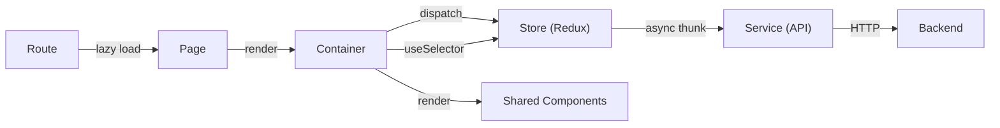

# Skill: Viết Container & Page cho dự án CRM

> Hướng dẫn chi tiết cách tạo **Container** và **Page** mới cho dự án React + TypeScript theo kiến trúc của CRM App.

---

## Mục lục

1. [Tổng quan kiến trúc](#1-tổng-quan-kiến-trúc)
2. [Cấu trúc thư mục](#2-cấu-trúc-thư-mục)
3. [Quy trình tạo module mới (Full Vertical Slice)](#3-quy-trình-tạo-module-mới)
4. [Bước 1: Định nghĩa Type](#bước-1-định-nghĩa-type)
5. [Bước 2: Tạo Service](#bước-2-tạo-service)
6. [Bước 3: Tạo Store (Redux Slice)](#bước-3-tạo-store-redux-slice)
7. [Bước 4: Đăng ký Store vào Root](#bước-4-đăng-ký-store-vào-root)
8. [Bước 5: Viết Container](#bước-5-viết-container)
9. [Bước 6: Viết Page](#bước-6-viết-page)
10. [Bước 7: Đăng ký Route](#bước-7-đăng-ký-route)
11. [Các mẫu Container phổ biến](#các-mẫu-container-phổ-biến)
12. [Quy tắc & Best Practices](#quy-tắc--best-practices)

---

## 1. Tổng quan kiến trúc

Dự án sử dụng mô hình **Page → Container** separation:

```
Page (thin wrapper) → Container (toàn bộ logic + UI)
```



### Tech Stack

| Layer | Công nghệ |
|-------|-----------|
| **UI Library** | Ant Design (`antd`) + `antd-mobile` |
| **State Management** | Redux Toolkit (`@reduxjs/toolkit`) |
| **Routing** | React Router DOM v6 (`react-router-dom`) |
| **i18n** | `react-i18next` |
| **Styling** | CSS Modules (`.module.scss`) |
| **HTTP Client** | Axios (được wrap trong `AxiosGW`) |
| **Validation** | Joi (qua custom hook `useValidation`) |

---

## 2. Cấu trúc thư mục

```
src/
├── types/                    # TypeScript type definitions
│   └── product.type.ts       # Entity type + Request/Response types
├── services/                 # API service classes (static methods)
│   └── product.service.ts
├── stores/                   # Redux store
│   ├── Store.tsx             # Root store config
│   ├── index.ts              # Barrel export tất cả slices
│   └── product/              # Một slice cho mỗi module
│       ├── actions.ts        # createAsyncThunk actions
│       ├── reducer.ts        # createSlice reducer
│       ├── selectors.ts      # createSelector selectors
│       └── index.ts          # Barrel export cho slice
├── containers/               # Business logic + UI
│   └── Product/
│       └── ListContainer/
│           ├── index.tsx      # Container component
│           └── styles.module.scss
├── pages/                    # Thin wrapper pages
│   └── Product/
│       └── List/
│           └── index.tsx      # Page component
├── routes/
│   ├── Router.tsx            # Route definitions
│   └── PrivateRouter.tsx     # Auth guard
├── constants/
│   └── router.ts             # Route paths
├── hooks/                    # Custom hooks
├── components/               # Shared/reusable components
└── utils/                    # Utility functions
```

---

## 3. Quy trình tạo module mới

Khi tạo một CRUD module mới (ví dụ: **Product**), thực hiện theo thứ tự:

```
Type → Service → Store → Register Store → Container → Page → Route
```

---

## Bước 1: Định nghĩa Type

📁 **File:** `src/types/product.type.ts`

```typescript
import type { CommonResponse } from './common.type';

// === Entity Type ===
export type ProductType = {
    id: string;
    name: string;
    price: number;
    stock: number;
    createdBy: string | null;
    createdAt: string;
    updatedAt: string;
    deletedAt: string | null;
};

// === Request Types ===
export type CreateProductReq = {
    productName: string;
    price: number;
    stock: number;
};

export type UpdateProductReq = CreateProductReq;

// === Response Types ===
export type GetProductListRes = CommonResponse<ProductType[]>;
```

### Quy tắc đặt tên Type

| Loại | Pattern | Ví dụ |
|------|---------|-------|
| Entity | `{Entity}Type` | `ProductType` |
| Create Request | `Create{Entity}Req` | `CreateProductReq` |
| Update Request | `Update{Entity}Req` | `UpdateProductReq` |
| List Response | `Get{Entity}ListRes` | `GetProductListRes` |

### Common Types có sẵn

```typescript
// src/types/common.type.ts
export type CommonResponse<T> = {
    code: number;
    message: string;
    data: T;
};

export type PagingReq = {
    page?: number;     // 1-based index
    limit?: number;    // items per page
};

export type CommonReq = {
    search?: string;
};
```

---

## Bước 2: Tạo Service

📁 **File:** `src/services/product.service.ts`

```typescript
import type {
    GetProductListRes,
    CreateProductReq,
    UpdateProductReq
} from '@/types/product.type';

import { AxiosGW } from './axios.service';

export default class ProductService {
    static async getList(): Promise<GetProductListRes> {
        return (await AxiosGW.get('/api/v1/product/list')).data;
    }

    static async create(payload: CreateProductReq): Promise<{ code: number; message: string }> {
        return (await AxiosGW.post('/api/v1/product/create', payload)).data;
    }

    static async update(id: string | number, payload: UpdateProductReq): Promise<{ code: number; message: string }> {
        return (await AxiosGW.put(`/api/v1/product/${id}/update`, payload)).data;
    }

    static async delete(id: string | number): Promise<{ code: number; message: string }> {
        return (await AxiosGW.delete(`/api/v1/product/${id}/delete`)).data;
    }
}
```

### Quy tắc Service

- **Dùng `class` với `static` methods** — không cần instantiate.
- **Luôn return `.data`** từ Axios response.
- **Import `AxiosGW`** từ `./axios.service` — đã được config sẵn interceptors, base URL, token.
- **Kiểu return**: `Promise<GetProductListRes>` cho list, `Promise<{ code: number; message: string }>` cho CUD.

---

## Bước 3: Tạo Store (Redux Slice)

Mỗi store module gồm **4 files** trong thư mục riêng:

### 3.1 Actions

📁 **File:** `src/stores/product/actions.ts`

```typescript
import { createAsyncThunk } from '@reduxjs/toolkit';

import ProductService from '@/services/product.service';
import type { CreateProductReq, UpdateProductReq } from '@/types/product.type';

export const getProductListAction = createAsyncThunk(
    'product/getList',
    async () => {
        return await ProductService.getList();
    }
);

export const createProductAction = createAsyncThunk(
    'product/create',
    async (payload: CreateProductReq) => {
        return await ProductService.create(payload);
    }
);

export const updateProductAction = createAsyncThunk(
    'product/update',
    async ({ id, payload }: { id: string | number; payload: UpdateProductReq }) => {
        return await ProductService.update(id, payload);
    }
);

export const deleteProductAction = createAsyncThunk(
    'product/delete',
    async (id: string | number) => {
        return await ProductService.delete(id);
    }
);
```

### 3.2 Reducer

📁 **File:** `src/stores/product/reducer.ts`

```typescript
import { createSlice } from '@reduxjs/toolkit';

import type { ProductType } from '@/types/product.type';
import { isSuccessCode } from '@/utils';

import { getProductListAction } from './actions';

interface ProductState {
    list: ProductType[];
    isLoading: boolean;
}

const initialState: ProductState = {
    list: [],
    isLoading: false,
};

const productSlice = createSlice({
    name: 'product',
    initialState,
    reducers: {
        clearProductList: (state) => {
            state.list = [];
        },
    },
    extraReducers: (builder) => {
        builder
            .addCase(getProductListAction.pending, (state) => {
                state.isLoading = true;
            })
            .addCase(getProductListAction.fulfilled, (state, action) => {
                state.isLoading = false;
                if (isSuccessCode(action.payload.code)) {
                    state.list = action.payload.data;
                }
            })
            .addCase(getProductListAction.rejected, (state) => {
                state.isLoading = false;
            });
    },
});

export const { clearProductList } = productSlice.actions;
export default productSlice.reducer;
```

> **Lưu ý:** Nếu có phân trang server-side, thêm `total: number` vào state và xử lý trong `fulfilled`.

### 3.3 Selectors

📁 **File:** `src/stores/product/selectors.ts`

```typescript
import { createSelector } from '@reduxjs/toolkit';

import type { RootState } from '../Store';

const selectProductSlice = (state: RootState) => state.product;

export const productSelector = createSelector(
    selectProductSlice,
    (state) => state
);

export const productListSelector = createSelector(
    selectProductSlice,
    (state) => state.list
);

export const productLoadingSelector = createSelector(
    selectProductSlice,
    (state) => state.isLoading
);
```

### 3.4 Barrel Export

📁 **File:** `src/stores/product/index.ts`

```typescript
// Reducer
export { default as ProductReducer, clearProductList } from './reducer';

// Actions
export { getProductListAction, createProductAction, updateProductAction, deleteProductAction } from './actions';

// Selectors
export { productSelector, productListSelector, productLoadingSelector } from './selectors';
```

---

## Bước 4: Đăng ký Store vào Root

### 4.1 Thêm vào `src/stores/Store.tsx`

```diff
+import { ProductReducer } from './product';

 export const store = configureStore({
     reducer: {
         common: CommonReducer,
         user: UserReducer,
         // ... existing reducers
+        product: ProductReducer,
     },
 });
```

### 4.2 Thêm vào `src/stores/index.ts`

```diff
+// Product slice
+export { ProductReducer, clearProductList, getProductListAction, createProductAction, updateProductAction, deleteProductAction } from './product';
+export { productSelector, productListSelector, productLoadingSelector } from './product';
```

---

## Bước 5: Viết Container

📁 **File:** `src/containers/Product/ListContainer/index.tsx`

Container là **component chính** chứa toàn bộ logic và UI. Dưới đây là template cho CRUD list:

```tsx
import React, { useEffect, useCallback, useMemo } from 'react';

import { PlusOutlined, EditOutlined, DeleteOutlined, ExclamationCircleOutlined } from '@ant-design/icons';
import { Table, Button, Modal } from 'antd';
import type { ColumnsType } from 'antd/es/table';
import { useTranslation } from 'react-i18next';

import FormModal, { type FormField } from '@/components/FormModal';
import { useDisclosure } from '@/hooks';
import { useDispatch, useSelector } from '@/stores';
import {
    getProductListAction,
    createProductAction,
    updateProductAction,
    deleteProductAction,
    productListSelector
} from '@/stores/product';
import type { ProductType } from '@/types/product.type';
import { isSuccessCode } from '@/utils';

import styles from './styles.module.scss';

const ProductListContainer: React.FC = () => {
    const { t } = useTranslation();
    const dispatch = useDispatch();
    const productList = useSelector(productListSelector);
    const { isOpen, onOpen, onClose } = useDisclosure();
    const [selectedItem, setSelectedItem] = React.useState<ProductType | null>(null);

    // ===== 1. FETCH DATA =====
    useEffect(() => {
        dispatch(getProductListAction());
    }, [dispatch]);

    // ===== 2. HANDLERS =====
    const handleSubmit = useCallback(async (values: Record<string, string>) => {
        let result;
        if (selectedItem) {
            result = await dispatch(updateProductAction({
                id: selectedItem.id,
                payload: {
                    productName: values.productName || '',
                    price: Number(values.price) || 0,
                    stock: Number(values.stock) || 0,
                },
            })).unwrap();
        } else {
            result = await dispatch(createProductAction({
                productName: values.productName || '',
                price: Number(values.price) || 0,
                stock: Number(values.stock) || 0,
            })).unwrap();
        }

        if (isSuccessCode(result.code)) {
            onClose();
            setSelectedItem(null);
            dispatch(getProductListAction());
        }
    }, [dispatch, onClose, selectedItem]);

    const handleEdit = useCallback((record: ProductType) => {
        setSelectedItem(record);
        onOpen();
    }, [onOpen]);

    const handleDelete = useCallback((id: string) => {
        Modal.confirm({
            title: t('confirmDelete'),
            icon: <ExclamationCircleOutlined />,
            content: t('confirmDeleteMessage'),
            maskClosable: true,
            onOk: async () => {
                const result = await dispatch(deleteProductAction(id)).unwrap();
                if (isSuccessCode(result.code)) {
                    dispatch(getProductListAction());
                }
            },
        });
    }, [dispatch, t]);

    const handleClose = useCallback(() => {
        setSelectedItem(null);
        onClose();
    }, [onClose]);

    // ===== 3. FORM FIELDS =====
    const formFields: FormField[] = [
        {
            name: 'productName',
            label: t('productName'),
            placeholder: t('enterProductName'),
            required: true,
        },
    ];

    // ===== 4. TABLE COLUMNS =====
    const columns: ColumnsType<ProductType> = useMemo(() => [
        {
            title: t('id'),
            dataIndex: 'id',
            key: 'id',
            width: 80,
            align: 'center',
        },
        {
            title: t('productName'),
            dataIndex: 'name',
            key: 'name',
            align: 'center',
        },
        {
            title: t('function'),
            key: 'action',
            width: 100,
            align: 'center',
            render: (_, record) => (
                <div style={{ display: 'flex', gap: '8px', justifyContent: 'center' }}>
                    <Button
                        type="text"
                        icon={<EditOutlined style={{ color: '#1890ff' }} />}
                        onClick={() => handleEdit(record)}
                    />
                    <Button
                        type="text"
                        icon={<DeleteOutlined style={{ color: '#ff4d4f' }} />}
                        onClick={() => handleDelete(record.id)}
                    />
                </div>
            ),
        },
    ], [t, handleEdit, handleDelete]);

    // ===== 5. RENDER =====
    return (
        <div className={styles.wrapper}>
            <div className={styles.header}>
                <h2 className={styles.title}>{t('productList')}</h2>
                <Button
                    type="primary"
                    icon={<PlusOutlined />}
                    onClick={onOpen}
                    className={styles.createBtn || ''}
                >
                    {t('create')}
                </Button>
            </div>

            <Table
                className={styles.table || ''}
                columns={columns}
                dataSource={productList}
                rowKey="id"
                pagination={{
                    pageSize: 10,
                    showSizeChanger: true,
                    showTotal: (total) => `${t('total')}: ${total}`,
                }}
            />

            <FormModal
                visible={isOpen}
                title={selectedItem ? t('editProduct') : t('createProduct')}
                fields={formFields}
                initialValues={selectedItem ? { productName: selectedItem.name } : {}}
                submitText={t('confirm')}
                onSubmit={handleSubmit}
                onClose={handleClose}
            />
        </div>
    );
};

export default React.memo(ProductListContainer);
```

📁 **File:** `src/containers/Product/ListContainer/styles.module.scss`

```scss
.wrapper {
    padding: 24px;
}

.header {
    display: flex;
    justify-content: space-between;
    align-items: center;
    margin-bottom: 24px;
}

.title {
    margin: 0;
    font-size: 24px;
    font-weight: 600;
    color: var(--primary-text-color);
}

.table {
    :global {
        .ant-table-cell {
            white-space: nowrap;
        }
    }
}

.createBtn {
    background-color: #52c41a;
    border-color: #52c41a;

    &:hover,
    &:focus {
        background-color: #73d13d !important;
        border-color: #73d13d !important;
    }
}
```

### Cấu trúc bên trong Container

Mỗi container nên có thứ tự code rõ ràng:

```
1. Hooks (useTranslation, useDispatch, useSelector, useDisclosure)
2. Local state (useState)
3. Side effects (useEffect) — fetch initial data
4. Handlers (useCallback) — submit, edit, delete, close
5. Form fields / Computed data (useMemo)
6. Table columns (useMemo)
7. JSX Return
```

---

## Bước 6: Viết Page

📁 **File:** `src/pages/Product/List/index.tsx`

```tsx
import ProductListContainer from '@/containers/Product/ListContainer';

const ProductListPage = () => {
    return <ProductListContainer />;
};

export default ProductListPage;
```

> **Nguyên tắc Page:**
> - Page chỉ là **thin wrapper**, **KHÔNG chứa logic**.
> - Nhiệm vụ duy nhất: import và render Container.
> - Nơi phù hợp để thêm: analytics tracking (`useSendGA`), SEO meta tags, page-level error boundaries.

---

## Bước 7: Đăng ký Route

### 7.1 Thêm route path vào constants

📁 **File:** `src/constants/router.ts`

```diff
 export const ROUTES = {
     HOME: '/home',
     USER: '/user',
     USER_ROLE: '/user/roles',
     LOGIN: '/login',
     ITEM_CATEGORY: '/item-category',
     ITEM_LIST: '/item',
+    PRODUCT: '/product',
 };
```

### 7.2 Thêm vào Router

📁 **File:** `src/routes/Router.tsx`

```diff
+const ProductListPage = lazy(() => import('@/pages/Product/List'));

 const Router: RouteObject[] = [
     {
         path: ROUTES.LOGIN,
         element: <LoginPage />
     },
     {
         element: <PrivateRouter />,
         children: [
             {
                 element: <MainLayout />,
                 children: [
                     // ... existing routes
+                    {
+                        path: ROUTES.PRODUCT,
+                        element: <ProductListPage />
+                    },
                 ]
             }
         ]
     },
 ];
```

### Cấu trúc Route

```
/ ──── LoginPage (public)
├──── PrivateRouter (auth guard)
│     └──── MainLayout (sidebar + header)
│           ├──── /home → HomePage
│           ├──── /user → UserPage
│           ├──── /user/roles → RoleListPage
│           ├──── /item-category → ItemCategoryListPage
│           ├──── /item → ItemListPage
│           └──── /product → ProductListPage (NEW)
```

- **Public routes**: Đặt ngoài `PrivateRouter` (như Login).
- **Protected routes**: Đặt bên trong `PrivateRouter > MainLayout`.
- **Lazy loading**: Luôn dùng `lazy(() => import(...))`.

---

## Các mẫu Container phổ biến

### Mẫu 1: Simple CRUD List (không phân trang server-side)

> Dùng cho: **ItemCategory**, **Role** — data ít, load tất cả 1 lần.

**Đặc điểm:**
- `useEffect` fetch all data 1 lần khi mount
- `pagination` chỉ ở phía client (Ant Table tự xử lý)
- Dùng `Modal.confirm` cho delete
- Dùng `FormModal` cho create/edit (cùng 1 modal, phân biệt bằng `selectedItem`)

```tsx
// Pattern
const { isOpen, onOpen, onClose } = useDisclosure();
const [selectedItem, setSelectedItem] = useState<EntityType | null>(null);

// Create & Edit dùng chung 1 modal
// selectedItem === null → Create mode
// selectedItem !== null → Edit mode
```

### Mẫu 2: Advanced CRUD List (có phân trang + search server-side)

> Dùng cho: **Item**, **User** — data nhiều, cần phân trang.

**Đặc điểm:**
- State cho `filters` (search, gender...) và `pagination` (current, pageSize)
- Debounce search (500ms)
- `fetchData` callback với params
- `handleTableChange` cho pagination
- Dùng `ConfirmModal` component riêng cho delete
- Có thể có nhiều modal (FormModal cho create, FormModal cho edit, DetailModal, ConfirmModal)

```tsx
// State pattern
const [filters, setFilters] = useState({ search: '', gender: undefined });
const [pagination, setPagination] = useState({ current: 1, pageSize: 10 });
const [debouncedSearch, setDebouncedSearch] = useState('');

// Debounce effect
useEffect(() => {
    const timer = setTimeout(() => {
        setDebouncedSearch(filters.search);
        setPagination(prev => ({ ...prev, current: 1 }));
    }, 500);
    return () => clearTimeout(timer);
}, [filters.search]);

// Fetch effect
const fetchData = useCallback(() => {
    const params: any = {
        page: pagination.current,
        limit: pagination.pageSize,
    };
    if (debouncedSearch) params.search = debouncedSearch;
    dispatch(getListAction(params));
}, [dispatch, debouncedSearch, pagination.current, pagination.pageSize]);

useEffect(() => { fetchData(); }, [fetchData]);
```

### Mẫu 3: Dashboard / Display-only Container

> Dùng cho: **Home** — chỉ hiển thị, không CRUD.

```tsx
const HomeContainer: React.FC = () => {
    const { t } = useTranslation();
    return (
        <div className={styles.wrapper}>
            <h2 className={styles.title}>{t('dashboard')}</h2>
            <Row gutter={[24, 24]}>
                <Col xs={24} lg={12}><ChartA /></Col>
                <Col xs={24} lg={12}><ChartB /></Col>
            </Row>
        </div>
    );
};
```

### Mẫu 4: Form Container (Login, Settings)

> Dùng cho: **Login** — form đơn lẻ với validation.

```tsx
// Dùng custom hooks
const { formData, onChangeForm } = useFormData<LoginFormData>(initForm);
const { errorMessage, onValidate } = useValidation<LoginFormData>({
    phoneNumber: JOI.PHONE_REQUIRE,
    password: JOI.PASSWORD,
});

const handleSubmit = async () => {
    const isError = onValidate(formData);
    if (isError) return;
    // call API directly (không qua Redux)
    const response = await AuthService.login(formData);
    // ...
};
```

---

## Quy tắc & Best Practices

### Container Rules

| # | Quy tắc |
|---|---------|
| 1 | Luôn wrap component với `React.memo()` khi export |
| 2 | Dùng `useCallback` cho tất cả handler functions |
| 3 | Dùng `useMemo` cho columns, computed data, form fields |
| 4 | Dùng `useTranslation()` — không hard-code text |
| 5 | Dùng `useDisclosure()` hook cho modal state |
| 6 | Dùng `isSuccessCode(result.code)` để check API response |
| 7 | Sau CUD thành công → re-fetch list data |
| 8 | Styling qua CSS Modules (`.module.scss`), không inline styles (trừ flex nhỏ) |

### Import Order

```tsx
// 1. React
import React, { useEffect, useCallback, useMemo, useState } from 'react';

// 2. Third-party (icons, antd, i18n...)
import { PlusOutlined } from '@ant-design/icons';
import { Table, Button } from 'antd';
import { useTranslation } from 'react-i18next';

// 3. Internal shared (@/components, @/hooks, @/stores, @/types, @/utils)
import FormModal from '@/components/FormModal';
import { useDisclosure } from '@/hooks';
import { useDispatch, useSelector } from '@/stores';
import { getProductListAction } from '@/stores/product';
import type { ProductType } from '@/types/product.type';
import { isSuccessCode } from '@/utils';

// 4. Local (relative imports)
import styles from './styles.module.scss';
```

### Shared Components có sẵn

| Component | Mô tả | Props chính |
|-----------|--------|-------------|
| `FormModal` | Modal form đa năng | `visible`, `title`, `fields: FormField[]`, `initialValues`, `onSubmit`, `onClose` |
| `ConfirmModal` | Modal xác nhận | `visible`, `title`, `content`, `onConfirm`, `onCancel` |
| `UserDetailModal` | Modal chi tiết user | `visible`, `account`, `onClose` |
| `TextInput` | Input có error display | `prefix`, `placeholder`, `value`, `onChange`, `error`, `type` |

### Custom Hooks có sẵn

| Hook | Mô tả | Return |
|------|--------|--------|
| `useDisclosure` | Toggle state cho modal/popup | `{ isOpen, onOpen, onClose, onToggle }` |
| `useFormData<T>` | Quản lý form state | `{ formData, onChangeForm }` |
| `useValidation<T>` | Joi validation | `{ errorMessage, onValidate }` |
| `useDirection` | Navigation helper | `{ goTo }` |
| `useDebounce` | Debounce value | debounced value |

### Utility Functions có sẵn

| Function | Mô tả |
|----------|--------|
| `isSuccessCode(code)` | Check API response code thành công |
| `formatPrice(value, withCurrency)` | Format giá tiền |
| `formatDate(dateString)` | Format ngày tháng |
| `safeJsonParse<T>(str)` | Parse JSON an toàn |
| `delayNavigate(fn)` | Delay navigation |

---

## Checklist tạo module mới

```
[ ] 1. Tạo file type: src/types/{module}.type.ts
[ ] 2. Tạo file service: src/services/{module}.service.ts
[ ] 3. Tạo thư mục store: src/stores/{module}/
[ ]    3.1 actions.ts
[ ]    3.2 reducer.ts
[ ]    3.3 selectors.ts
[ ]    3.4 index.ts (barrel export)
[ ] 4. Đăng ký store:
[ ]    4.1 Import reducer vào Store.tsx
[ ]    4.2 Export từ stores/index.ts
[ ] 5. Tạo container: src/containers/{Module}/{Feature}Container/
[ ]    5.1 index.tsx
[ ]    5.2 styles.module.scss
[ ] 6. Tạo page: src/pages/{Module}/{Feature}/index.tsx
[ ] 7. Đăng ký route:
[ ]    7.1 Thêm path vào constants/router.ts
[ ]    7.2 Lazy import + thêm route vào Router.tsx
[ ] 8. Thêm i18n keys vào src/locales/ (nếu cần)
```
